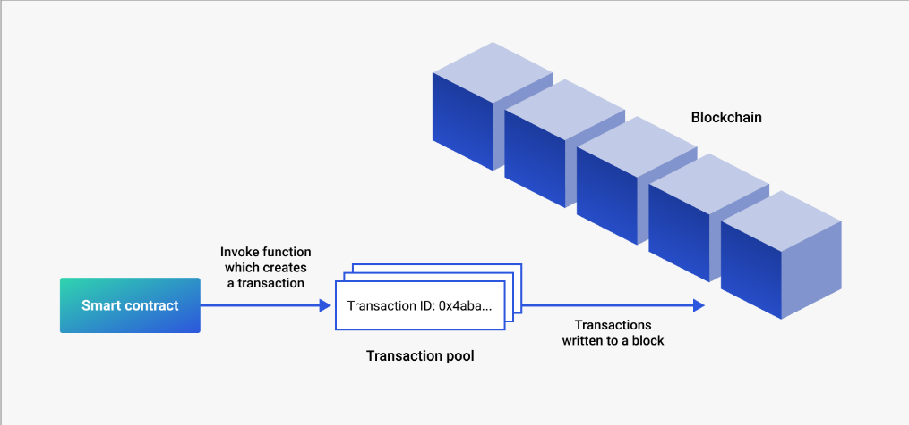

# Solidity - Linguagem Orientada a Contrato

- Solidity é voltada para o registro e leitura de transações em contratos inteligentes na blockchain.
- Projetada para ser executada sobre a Etherum Virtual Machine (EVM).
- Pode ser utilizada para desenvolver contratos como votações, crowdfunding, rastreabilidade de ativos, NFT'S, entre outros.

## Plataforma Etherum

- É uma plataforma descentralizada de uma blockchain que suporta os contratos inteligentes, aplicações que executam de forma independente, sem downtime, censura, fraude ou interferência de terceiros.

# Smart Contracts

- É um protocolo direcionado para verificar e garantir de forma digital a performance e a confiabilidade de um contrato, sendo um intermediário entre as partes.
- Dessa forma as transações são rastreaveis e irreversiveis, deixando para a criptografia a garantia de veracidade dos dados.
- Um Smart Contract baseado em Solidity é uma coleção de funções e dados, e esta registrado em um endereço na blockchain do Ethereum.

